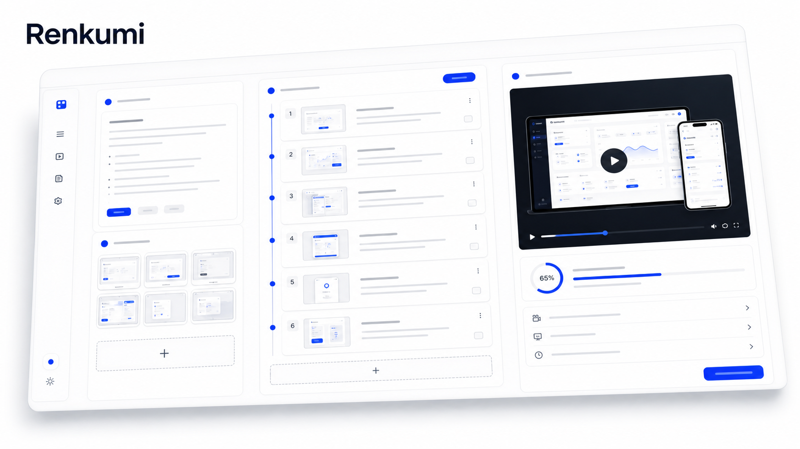
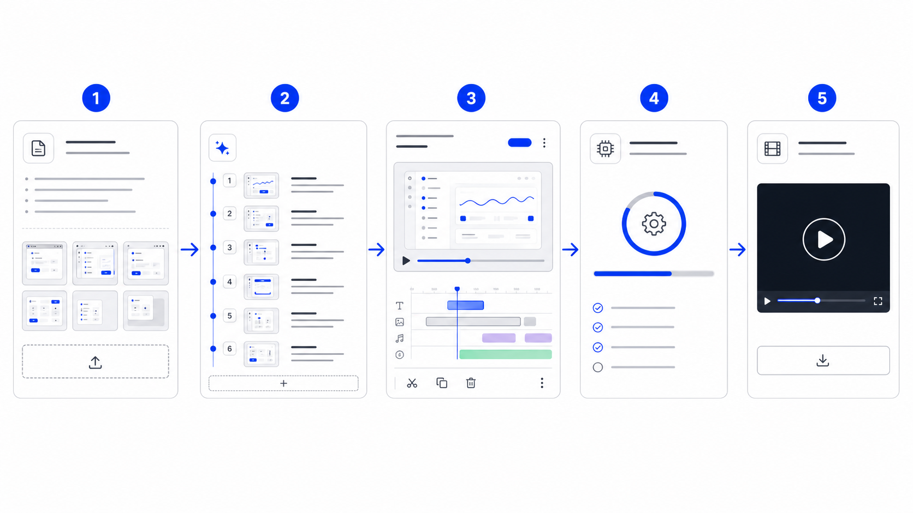

# Renkumi



Renkumi（レンクミ）是一个面向产品团队的 AI 视频生成工作台。它把产品描述、真实截图、品牌风格和输出规格整理成结构化 `videoSpec`，再交给 Remotion 或 HyperFrames 合成为可复用的产品展示视频。

名字来自 `Render` 和日语动词 `Kumu`，含义是“组合、编排”。这个项目的核心目标也是如此：把文字、截图、镜头和动态组合成一条可以持续迭代的发布视频生产线。

## 能做什么

- 用一段产品 brief 生成品牌信息、分镜、文案、镜头节奏和视觉风格。
- 上传产品截图，并把截图绑定到每个视频镜头。
- 在工作台里编辑分镜标题、副标题、旁白、素材和输出参数。
- 选择 Remotion 或 HyperFrames 渲染引擎，在本地生成 MP4；部署到 Vercel 时通过 Blob 队列交给独立 worker 渲染。
- 可选接入 OpenAI 文本、视觉和图片模型，用于 AI 分镜、截图理解和图片增强。

## 工作流



1. 输入产品描述、目标卖点和行动号召。
2. 上传真实产品截图，让视频画面保留可信度。
3. AI 生成可编辑的视频创意方案和分镜结构。
4. 在工作台确认镜头、素材、节奏和渲染引擎。
5. 本地渲染并导出 MP4，用于官网、社媒或销售演示。

## 技术栈

- Next.js 15 + React 19
- TypeScript
- Remotion 4
- HyperFrames HTML composition
- OpenAI SDK 5
- 本地文件型 render store；Vercel 部署使用 Vercel Blob 保存渲染状态和视频文件，独立 worker 负责长时间渲染

## 快速开始

安装依赖：

```bash
pnpm install
```

启动开发服务：

```bash
pnpm dev
```

打开：

```text
http://localhost:3000
```

常用入口：

- `/`：产品首页
- `/generate/input`：输入 brief 和上传素材
- `/generate/ai-plan`：AI 生成方案
- `/generate/storyboard`：确认分镜
- `/generate/render`：渲染视频

## 环境变量

复制 `.env.example` 为 `.env.local`，按需配置：

```bash
OPENAI_API_KEY=
OPENAI_BASE_URL=
OPENAI_TEXT_MODEL=
OPENAI_IMAGE_MODEL=
BLOB_READ_WRITE_TOKEN=
RENDER_STORE=
RENDER_WORKER_ID=render-1
RENDER_WORKER_POLL_MS=3000
RENDER_WORKER_CONCURRENCY=1
```

`OPENAI_API_KEY` 是可选的。没有配置时，项目仍然可以使用默认脚本、示例素材和本地渲染流程；AI 分镜和图片生成会降级或跳过。

Vercel 上的 Remotion 渲染使用队列模式：在 Vercel 和独立 worker 环境中都设置 `RENDER_STORE=blob` 和同一个 `BLOB_READ_WRITE_TOKEN`。`/api/render` 只创建任务并立即返回任务 ID，worker 通过 `pnpm worker:render` 轮询 queued 任务、渲染 MP4 并上传到 Blob。`/api/render/health` 可检查 Blob 读写和最近的 worker 心跳。

部署 worker 时建议使用长期运行的 Node 环境，例如 Railway、Fly.io、Render Worker、VPS 或容器平台：

```bash
pnpm install --frozen-lockfile --prod=false
pnpm worker:render
```

HyperFrames 仍依赖本地浏览器、Python 和 ffmpeg，部署环境中暂时保持本地渲染路径；Vercel 队列模式只接受 Remotion。

## 脚本

```bash
pnpm dev                  # 启动 Next.js 开发服务
pnpm build                # 构建生产版本
pnpm start                # 启动生产服务
pnpm lint                 # ESLint 检查
pnpm typecheck            # TypeScript 检查
pnpm remotion:bundle      # 生成 Remotion 静态 bundle（按需使用）
pnpm render:sample        # 使用 Remotion 渲染示例视频
pnpm worker:render        # 启动独立 Remotion 渲染 worker
pnpm hyperframes:render   # 使用 HyperFrames 渲染示例视频
pnpm remotion:studio      # 打开 Remotion Studio
```

## 项目结构

```text
app/                      Next.js 页面与 API routes
components/               视频生成工作台组件
data/design-library/      品牌与视觉参考库
hyperframes/              HyperFrames 示例 composition
lib/                      videoSpec、AI 脚本、渲染与资产逻辑
public/assets/            静态图片、视频、上传与生成资产
remotion/                 Remotion composition
scripts/                  渲染与同步脚本
```

## 图片说明

README 顶部和工作流图片已用 Image 2.0 生成，并保存到：

- `public/assets/generated/readme-hero.png`
- `public/assets/generated/readme-workflow.png`

它们只用于文档展示，不参与视频渲染主流程。产品视频里的真实画面仍优先使用用户上传的产品截图。
